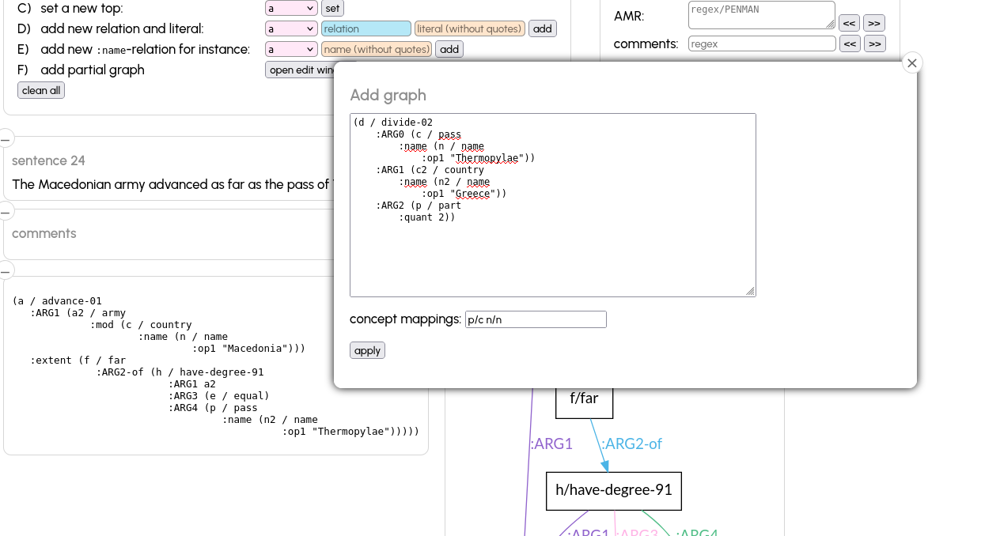
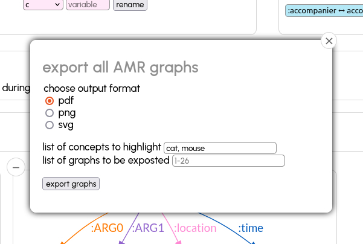
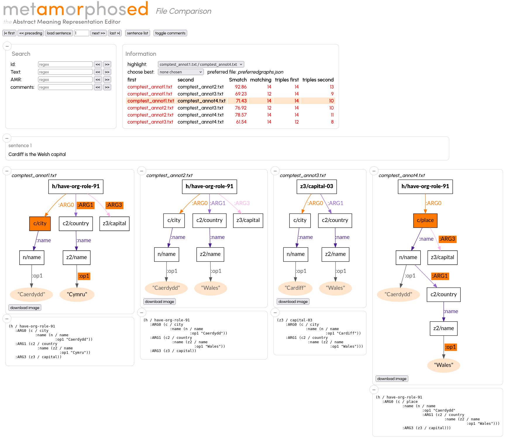

# metAMoRphosED: the AMR editor

* _metAMoRphosED_ is a graphical editor for easily editing Abstract Meaning Representation graphs (AMRs). _metAMoRphosED_ displays the graph in a graphical format and allows adding/deleting instances, edges, attributes and comments in a simple way.
* _metAMoRphosED_ makes it possible to add a graph to an existing graph.
* _metAMoRphosED_ reads and writes AMR-files in(to) "PENMAN" format. For examples of this format, visit the [AMR guidelines](https://github.com/amrisi/amr-guidelines) and the corpora released by
by LDC (https://catalog.ldc.upenn.edu/LDC2020T02).
* _metAMoRphosED_ runs as a local Web server, an internet browser must be used to navigate through the sentences and modifiy them. If the edited file is under git version control, every modification is automatically committed to the local repository.
* _metAMoRphosED_ can be started in comparison mode in order to compare two AMR files (e.g. a gold file and a predicted file, see section [AMR file comparison](#amr-file-comparison)).
* _metAMoRphosED_ allows text-grounded annotatation of coreferences in AMR graphs. See [coref/README.md](coref/README.md) for more information.
* _metAMoRphosED_ allows download of the displayed graphs as SVG or export of all graphs in either SVG, PDF or PNG format.
* _metAMoRphosED_ provides a script to calculate inter-annotator agreement (see section [Inter-annotator agreement](#inter-annotator-agreement)).

Current version 4.3.0 (see [CHANGES.md](CHANGES.md))

## TL;DR
* if you're updating from version up to 4.0.0: the file `server.py` has been renamed to `metamorphosed_server.py`, also install the additional packages:
```
pip install rdflib==7.0.0 oxrdflib==0.3.7
```
* if you are updating from versions up to 3.3.0, please install an additional packages:
```
pip install smatchpp==1.7.0 rdflib==7.0.0 oxrdflib==0.3.7
```

## installation

### Linux
python 3.10

```
apt install graphviz
python3 -m venv VENV
source VENV/bin/activate
pip install -r requirements.txt
git submodule update --init
pushd propbank-frames/frames;
  git checkout ad2bafa4c9c9c58cc1bc89;
  wget https://raw.githubusercontent.com/propbank/propbank-frames/development/frames/AMR-UMR-91-rolesets.xml
popd
./metamorphosed/installJQ.py
```

### Mac
```
brew install graphviz
python3 -m venv VENV
source VENV/bin/activate
pip install -r requirements.txt
git submodule update --init
pushd propbank-frames;  git checkout ad2bafa4c9c9c58cc1bc89; popd
./metamorphosed/installJQ.py
```

Note: For the PropBank frames, we need currently this intermediary version since the main and release-v3.4.1 branches
do not contain the definition of roles like `be-located-at-91`.

The script `./metamorphosed/installJQ.py` installs the following into `metamorphosed/gui/lib`
also needed:
* graphviz (see above `sudo apt install graphviz`)
* https://code.jquery.com/jquery-3.6.0.min.js
* https://cdnjs.cloudflare.com/ajax/libs/jquery-modal/0.9.2/jquery.modal.min.js
* https://cdnjs.cloudflare.com/ajax/libs/jquery-modal/0.9.2/jquery.modal.min.css
* https://jqueryui.com/resources/download/jquery-ui-1.13.2.zip


## tests

```
pytest unittests.py -vv [-k testname] [-s]
```

For more complete testing use `tox`:

```
pip install -r requirements-test.txt
tox
```


## run

```
<install-path>/metamorphosed_server.py -f <amr-file> \
	[-p <port>] \
	[--relations <relations.txt>]
	[--concepts <concepts.txt>]
	[--pbframes <propbank-frames-dir>]
	[--constraints <constraints.yml>]
        [--reifications <reification-table.txt]
        [--readonly]
        [--author 'Name <mail@example.com>']
        [--compare <amr-file2>]
        [--smatchpp]
```

Use our internet browser as GUI: https://localhost:<port>


* The `relations.txt` file must contain all the relations which are valid in the AMR graphs, the editor will show a warning for each relation found in a graph which is not mentioned in this file. The relations will also be used for autocompletion. The file [metamorphosed/data/relations.txt](relations.txt) is used as default value.
* If `--concepts concepts.txt` is given, the concepts will be used for autocompletion.
* The option `--reifications` loads a table with relations which can be reified (default: [metamorphosed/data/reification-able.txt](reification-able.txt))
* `propbank-frames-dir` is the `frames` directory within the directory where `https://github.com/propbank/propbank-frames` has been cloned.
* If the edited file is under git version control, every click on `save` will create a git commit. In order to use a different user name, specify the user with `--author 'Name <mail@example.com>'`.
* `constraints.yml` a file which defines predicate and object constraints (i.e. no other predicate and object is allowed in a given context. E.g.:

```
subjects:
  # name-instances must only have :opN predicates, which have quoted strings as objects (initial _ indicates that the predicated or object is a regex
  name:
    _:op\d:
      - _".*"

  # date-entity instances must only have :month, :day and :year predicates with integer values as objects
  date-entity:
    :month:
      - _\d\d?
    :day:
      - _\d\d?
    :year:
      - _\d\d\d\d

  # (Non AMR) a hotel instances can only have :lieu relation to an address instance or a :starts relation to a hotelclass instance
  hotel:
    :lieu :
      - address
    :stars:
      - hotelclass

  # an and instance dan only have :op1 and :op2 predicates with any object
  and:
    _:op\d:


# constraints for predicates and objects, independent of the subject
predicates:
  :location:
     - city
     - country
  :wiki:
     - _"Q\d+"

  :quant:
     - _\d+
     - _\d\.\d+
```

A predicate with an initial `_` means that the predicate is interpreted as a regex. for example

```
subjects:
...
  and:
    _:op\d:
```

means that an instance of the class `and` may have predicates which match the regex `:op\d`  (":op" followoed by a digit)

Objects with initial `_` means that the object of the predicate is not an instance of a class but a literal which matches the regex.
E.g.

```
predicates:
  :wiki:
     - _"Q\d+"

  :quant:
     - _\d+

```

means that the predicate `:wiki` (starting at any subject) must have a string literal as object which matches `"Q\d+"` (including the quotes!).
The objects of all predicates `:quant` must match `\d+`, i.e. an integer


**Note:** `relations.txt` and `constraints.yml` must not be modified in order to not break the unitary tests. Please use a personalised file.


## Validate AMR files

The script `amrdoc.py` can check whether concepts (with an suffixe line `-01`) are well defined in PropBank and that all used `:ARGn` relations are defined for a given concept. If a list of valid relations in given, it will detect relations in the AMR file which are not defined.

```
./validate.py --validate \
	--rels <relations.txt> \
	--pbframes <propbank-frames-dir> \
	--constraintes <constraints.yml> \
	amrfile.txt
```

If necessary, adapt a copy of `constraints.yml` to your needs.

# Editing

Start the server with an AMR file. The file must have the same format as the official AMR distribution, e.g.:

```
# ::id a sentence id
# ::snt the sentence in plain text
(.... AMR graph in PENMAN notation)

# ::id following id
...
```

After a sentence an empty line must follow. If you start annotating new sentence, the initial PENMAN format must be at least an empty pair of parentheses: `()`

Once the server is up and running click on one of the navigation buttons to load a sentence (`first`, `preceding`, `next`, `last`)
or enter a sentence number and lick `read sentence`. The sentence is shown in PENMAN format and in a graphical visualisation.

If the file being edited is under git control, it will be saved under the same name followed by git add/git commit. Else it is saved using an additional `.2` file suffix. If the edited file is not git controlled and if the file with suffix `.2` exists already, the server exits with an error message.
In this case rename the `.2` file and edit the renamed file.

The graph can be extended/modified by the functions in the `Add concept/edges/names` field:
fill in the fields and hit the add button
* adding new instances /concepts
* adding relations (like `:ARG0` or `:location` between to instances. If the preceded by `/`, the following will be interpreted as a conceptname, so a new instances of this concept will be created first and than used for the new relation. The prefix `//` first tries to find an existing instance of this concept to be used, if this cannot be found, a new instance is created.
* define which instance is the `top instance` (appears on top in the PENMAN notation)
* add a relation and a literal (like `:quant 200`)
* add a name instance and `:op1` etc. to strings
* to download the graphical version as SVG, click on `download image` (see also below section *Export*)


In order to modify or delete an existing instance or edge, click the instance/edge in the visual graph and use the edit window which opens on the top of the screen


In oder to attach an edge to another starting instance, just click first on the edge which start point is to be modified (the arrow head turns yellow) and click to the instance/concept note which is the new starting point.
**Note**: literal nodes cannot be the starting point of an edge.

### Adding a graph to the current graph

This functionality allows to merge an AMR-graph and the current graph by specifiying the instances of both graphs which are coreferent.
For instance, if the editor shows the following graph:


Click the button `open edit window` add the second graph (in PENMAN format), and specify the instances of the current graph which should be
identical to instances of the second graph.
Here `p` (from `(p / pass)`) of the current graph and  `c` (from `(c / pass)`) of the second graph (as well as `n` and `n`) are identical instances.
Matching instances must be separated by a `/`, multiple matches are separated by a space.



then click the `apply` button to see the result.

## Search, further info

On the bottom of the main screen propbank definitions for all used concepts is displayed.
Basic search is available in the search field. THE AMR-search field accepts two kinds of input
* a valid PENMAN graph: the search will find AMR graphs which contain the given PENMAN graph. So searching for `(e / eat-01 :ARG1 ( c / cheese ))` will find a graph like
```
(v1 / eat-01
  :ARG0 ( v2 / mouse )
  :ARG1 ( v3 / cheese ))
```

It is possible to use wildcards to match any concepts or relations; so searching for `(e / give-01 :* ( c / * ))` will find graphs like

```
(v1 / give-01
  :ARG0 ( v2 / man )
  ...)
```

```
(v1 / give-01
  :ARG1 ( v2 / book )
  ...)
```

```
(v1 / give-01
  :ARG2 ( v2 / child )
  ...)
```

* a regular expression: if the input is not a valid PENMAN graph, it is interpreted as a regular expression.
* For ID, Text and comment search, the input is always interpreted as a regular expression.

Clicking on `-` minimizes the sentence/PENMAN/graphics windows:


The `sentence list` button opens a list of all sentences to choose a particular one.
If the edited file is very large, filters can be applied to shorten the list (which may take too much time to load if not filtered).


## Reification

If the option `--reificiations` is used, a reifiable relation can be reified (and reversed, if the corresponding concept has no aditional relations. The following graph


becomes this after reifying `:location`


## Graph export

The button `export visualised graphs` opens a menu which allows to download all or a subset of graphs in either SVG, PDF or PNG format.
Choose format and numbers of sentences for which you want the graphic exported (default: all sentences)



## Edge prediction

(still Beta)

When creating a new edge (relation) between two instances, _metamorphosed_ tries to guess the most likely label for this relation. The implementation is very simple, if the target instance is of type `name` the guessed relation is `:name`, if the concept of the source instance is `name`, `and` or `or`, the guessed relation is `:op2`, else if the source relations ends with `-01` etc, the guessed relations is `:ARGn`. In moste cases this has to be correct.
However you can implement a more sophisticated classifier, trained on any data which is available to you and use your classifier. To do so,
Subclass the class `Basic_EdgePredictor` in [metamorphosed/edge_predictor.py](edge_predictor.py) and implement your classifier. You must redefine the method
`predict(self, source_concept, target_concept):`. For instance:

```
from metamorphosed.edge_predictor import Basic_EdgePredictor

class Perfect_EdgePredictor(Basic_EdgePredictor):
    def __init__(self, arglist):
        print("initialising my Perfect_EdgePredictor with %s as argument" % arglist[0])
        self.classifier = Perfect_Classifier(arglist[0])

    def predict(self, source_concept, target_concept):
        predicted_label = self.classifier.find(source_concept, target_concept)
        print("predicted label <<<%s>>>" % predicted_label)
	return predicted label
```

In order to use this class and the needed data, create a yaml file `mypredictor.yml`:

```
# __localpath__ is the path where the yaml file is placed in

# filename can also any relative or absolute path
filename: __localpath__/perfect_predictor.py
classname: Perfect_EdgePredictor
args:
  - __localpath__/mydata.dat
```

start _metamorphosed_ with the option `--edge_predictor` (or `-E`):

```
./metamorphosed_server.py --edge_predictor mypredictor.yml [other options]
```

# AMR file comparison

If you specify a second AMR file using the option `--compare <amr file>`, _metAMoRphosED_ will show the corresponding graphs of both files side-by-side, highlighting differences (in green) and displaying the [Smatch](https://github.com/snowblink14/smatch) score (with the option `--smatchpp` the [SmatchPP](https://github.com/flipz357/smatchpp/) package is used instead of Smatch):


It is possible to search in the text, PENMAN and comments as in the edit mode. However, editing is not possible.

To compare several files (for instance the annotations of multiple annotators), specify one of the files using the `-f <amr file 1>` option, and all other with  `--compare <amr file 2> <amr file 3> <amr file 4>`.
_metAMoRphosED_ switches automatically in multifile mode. In order to see the difference (and Smatch) between the two files for the displayed sentence choose the two files to compare with the `comparisons`-selection bar



# AMR Coreference editor

see [coref/README.md](coref/README.md)

# Inter-annotator agreement

_metAMoRphosED_ comes with a script which allows to calculate an inter-annotator agreement (IAA) score on 2 or more files containing the same sentences. The metrics used are Smatch F1
or the number of differences between two graphs (each concept or relation which is different or absent in one of the graphs is counted).

The IAA is calculated either by
* for each sentence:
   * calculate a score for each annotator pair and keep the average
   * calculate the average of the score obtained for each sentence
or

* for each annotator pair
   * calculate the score for each sentence and keep the average
   * calculate the average of the score obtained for annotator pair

By default Smatch is used. The option `--smatchpp` switches to SmatchPP (https://github.com/flipz357/smatchpp)
Whereas the default is faster, SmatchPP is using a different Solver (ILP instead of Smatch's HillClimber).
* ILP always gives the same result (even for more complicated matches)
* ILP provides verifiable and optimal results.

```
usage: iaa.py [-h] --files FILES [FILES ...] [--sentences] [--debug] [--runs RUNS] [--first FIRST] [--last LAST] [--smatchpp]
              [--report REPORT] [--sortcol SORTCOL]

inter-annotator agreement

options:
  -h, --help            show this help message and exit
  --files FILES [FILES ...], -f FILES [FILES ...]
                        AMR files of all annotatoris
  --sentences, -s       sentences are in inner loop
  --smatchpp, -S        use smatchpp instead of smatc
  --debug, -d           debug
  --runs RUNS           run smatch n times to get the best possible match
  --first FIRST         skip first n sentences
  --last LAST           stop after sentences n
  --report, -r REPORT
                        filename for a report in TSV format
  --sortcol SORTCOL     sort data in report file on column (needs --report)
```

For instance for the 3 test files provided the IAA can be calculated by
```
./iaa.py -f metamorphosed/data/comptest_annot1.txt metamorphosed/data/comptest_annot3.txt metamorphosed/data/comptest_annot4.txt -d
```

which results in:

```
4 sentences read from comptest_annot1.txt
4 sentences read from comptest_annot3.txt
4 sentences read from comptest_annot4.txt
sentence     0: annotator pairs smatch: [69.23, 71.43, 61.54]
                annotator pairs diffs.: [5.0, 4.0, 6.0]
sentence     1: annotator pairs smatch: [66.67, 75.0, 72.73]
                annotator pairs diffs.: [5.0, 4.0, 3.0]
sentence     2: annotator pairs smatch: [40.0, 22.22, 40.0]
                annotator pairs diffs.: [5.0, 6.0, 6.0]
sentence     3: annotator pairs smatch: [62.5, 50.0, 75.0]
                annotator pairs diffs.: [3.0, 4.0, 2.0]
averages for 4 sentences (smatch): [67.4, 71.46, 34.07, 62.5]
                          (diffs): [5.0, 4.0, 5.67, 3.0]
annotator pair inter-annotator agreement Smatch F1: 58.86 differences: 4.4167
```


Using the option `-s` loops on annotator pairs

```
./iaa.py -f comptest_annot1.txt comptest_annot3.txt comptest_annot4.txt -d -s
```


which results in:

```
4 sentences read from comptest_annot1.txt
4 sentences read from comptest_annot3.txt
4 sentences read from comptest_annot4.txt
annotators 0/1: sentence comparison smatch: [69.23, 66.67, 40.0, 62.5]
                sentence comparison diffs.: [5.0, 5.0, 5.0, 3.0]
annotators 0/2: sentence comparison smatch: [71.43, 75.0, 22.22, 50.0]
                sentence comparison diffs.: [4.0, 4.0, 6.0, 4.0]
annotators 1/2: sentence comparison smatch: [61.54, 72.73, 40.0, 75.0]
                sentence comparison diffs.: [6.0, 3.0, 6.0, 2.0]
averages for 3 annotator pairs (smatch): [59.6, 54.66, 62.32]
                                (diffs): [4.5, 4.5, 4.25]
sentence inter-annotator agreement Smatch F1: 58.86 differences: 4.4167
```

# License

* This software is under the [3-Clause BSD License](LICENSE).


# Reference

* Johannes Heinecke (2023) <a href="https://aclanthology.org/2023.isa-1.4/">metAMoRphosED: a graphical editor for Abstract Meaning
  Representation</a>. In ISA19 at International Workshop on Computational Semantics. Nancy. France. Association for Computational Linguistics.

```
@inproceedings{heinecke2023,
  author = {Heinecke, Johannes},
  title = {{metAMoRphosED: a graphical editor for Abstract Meaning Representation}},
  year = {2023},
  booktitle = {{19th Joint ACL - ISO Workshop on Interoperable Semantic Annotation}},
  address = {Nancy},
  url = {https://github.com/Orange-OpenSource/metamorphosed/}
}
```
