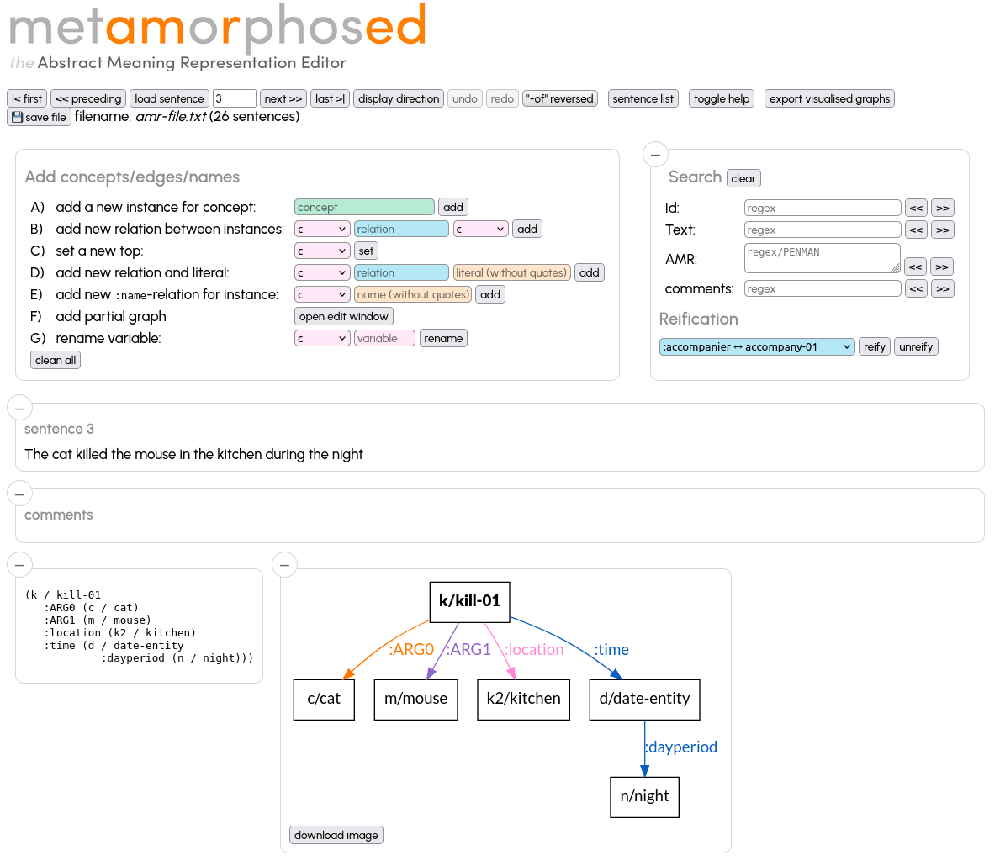
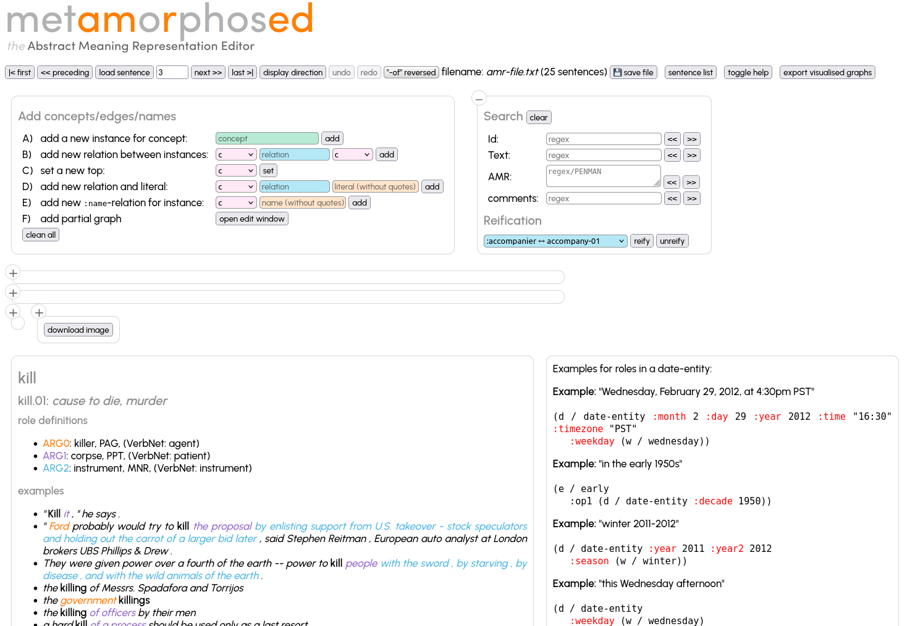

# metAMmoRphosED: the AMR editor

_metAMmoRphosED_ is a graphical editor to edit Abstract Meaning
Representations graphs (in PENMAN) format easily. _metAMmoRphosED_
displays the graph in a graphical format and allows adding/deleting
instances, edges, attributes and comments in a simple way.

_metAMmoRphosED_ reads and writes AMR-files as proposed by the principal AMR
site (https://amr.isi.edu/) and used in the AMr corpora proposed there and
by LDC (https://catalog.ldc.upenn.edu/LDC2020T02)

_metAMmoRphosED_ runs as a local Web server, an internet browser must be used to navigate through the sentences and modifiy them. If the edited file is under git version control, every modification is automatically commited to the local repository.

Version 2.6.0 (see [CHANGES.md](CHANGES.md))

## installation

### Linux 
python 3.10

```
apt install graphviz
python3 -m venv VENV
source VENV/bin/activate
pip install -r requirements.txt
git submodule update --init
pushd propbank-frames;
  git checkout ad2bafa4c9c9c58cc1bc89;
  wget https://raw.githubusercontent.com/propbank/propbank-frames/main/frames/AMR-UMR-91-rolesets.xml
popd
```

### Mac
```
brew install graphviz
python3 -m venv VENV
source VENV/bin/activate
pip install -r requirements.txt
git submodule update --init
pushd propbank-frames;  git checkout ad2bafa4c9c9c58cc1bc89; popd
```

Note: For the PropBank frames, we need currently this intermediary version since the main and release-v3.4.1 branches 
do not contain the definition of roles like `be-located-at-91`.

also needed: 
* graphviz (see above `sudo apt install graphviz`)
* https://code.jquery.com/jquery-3.6.0.min.js
* https://cdnjs.cloudflare.com/ajax/libs/jquery-modal/0.9.2/jquery.modal.min.js
* https://cdnjs.cloudflare.com/ajax/libs/jquery-modal/0.9.2/jquery.modal.min.css
* https://jqueryui.com/resources/download/jquery-ui-1.13.2.zip

the latter three must be installed in `gui/lib` via the following commands

```
mkdir -p gui/lib
wget https://code.jquery.com/jquery-3.6.0.min.js -O gui/lib/jquery-3.6.0.min.js
wget https://cdnjs.cloudflare.com/ajax/libs/jquery-modal/0.9.2/jquery.modal.min.js -O gui/lib/jquery.modal-0.9.2.min.js
wget https://cdnjs.cloudflare.com/ajax/libs/jquery-modal/0.9.2/jquery.modal.min.css -O gui/lib/jquery.modal-0.9.2.min.css
wget https://jqueryui.com/resources/download/jquery-ui-1.13.2.zip -O gui/lib/jquery-ui-1.13.2.zip
pushd gui/lib/
unzip jquery-ui-1.13.2.zip
popd
```


## tests

```
pytest unittests.py -vv [-k testname] [-s]
```


## run

```
<install-path>/server.py -f <amr-file> \
	[-p <port>] \
	[--relations <relations.txt>]
	[--concepts <concepts.txt>]
	[--pbframes <propbank-frames-dir>]
	[--constraints <constraints.yml>]
        [--reifications <reification-table.txt]
        [--readonly]
        [--author 'Name <mail@example.com>']
```

use our internet browser as GUI: https://localhost:<port>


* The `relations.txt` file must contain all the relations which are valid in the AMR graphs, the editor will show a warning for each relation found in a graph which is not mentioned in this file. The relations will also used for autocompletion
* If `--concepts concepts.txt` is given, the concepts will be used for autocompletion.
* The option `--reifications` loads a table with relations which can be reified ([reification-able.txt](reification-able.txt))
* `propbank-frames-dir` is the `frames` directory within the directory where `https://github.com/propbank/propbank-frames` has been cloned
* If the edited file is under git version control, every click on `save` will create a git commit. In order to use a different user name, specify the user with `--author 'Name <mail@example.com>'`
* `constraints.yml` a file which defines predicate and object constraints (i.e. no other predicate and object is allowed in a given context. E.g.

```
subjects:
  # name-instances must only have :opN predicates, which have quoted strings as objects (initial _ indicates that the predicated or object is a regex
  name:
    _:op\d:
      - _".*"

  # date-entity instances must only have :month, :day and :year predicates with integer values as objects
  date-entity:
    :month:
      - _\d\d?
    :day:
      - _\d\d?
    :year:
      - _\d\d\d\d

  # (Non AMR) a hotel instances can only have :lieu relation to an address instance or a :starts relation to a hotelclass instance
  hotel:
    :lieu :
      - address
    :stars:
      - hotelclass

  # an and instance dan only have :op1 and :op2 predicates with any object
  and:
    _:op\d:


# constraints for predicates and objects, independent of the subject
predicates:
  :location:
     - city
     - country
  :wiki:
     - _"Q\d+"

  :quant:
     - _\d+
     - _\d\.\d+
```

A predicate with an initial `_è means that the predicate is interpreted as a regex. for example

```
subjects:
...
  and:
    _:op\d:
```

means that an instance of the class `and` may have predicates which match the regex `:op\d`  (":op" followoed by a digit)

Objects with initial `_` means that the object of the predicate is not an instance of a class but a literal which matches the regex.
E.g.

```
predicates:
  :wiki:
     - _"Q\d+"

  :quant:
     - _\d+

```

means that the predicate `:wiki` (starting at any subject) must have a string literal as object which matches `"Q\d+"` (including the quotes!).
The objects of all predicates `:quant` must match `\d+`, i.e. an integer


**Note:** `relations.txt` and `constraints.yml` must not be modified in order not to break the unitary tests. Please use a personalised file.


## Validate AMR files


```
amrdoc.py --validate \
	--rels <relations.txt> \
	--pbframes <propbank-frames-dir> \
	--constraintes <constraints.yml> \
```

if necessary, adapt a copy of `constraints.yml` to your needs.

# Editing

Start the server with an AMR file. The file must have the same format as the official AMR distribution

```
# ::id a sentence id
# ::snt the sentence in plain text
(.... AMR graph in PENMAN notation)

# ::id following id
...
```

After a sentence an empty line must follow. If you start annotating new sentence, the initial PENMAN format must be at least en empty pair of parentheses: `()`

Once the server is up and running click on one of the navigation buttons to load a sentence (`first`, `preceding`, `next`, `last`)
or enter a sentence number and lick `read sentence`. The sentence is shown in PENMAN format and in a graphical visualisation.

If the file being edited is under git control, it will be saved under the same name followed by git add/git commit. Else it is saved using an additional `.2` file suffix. If the edited file is not git controlled and if the file with suffix `.2` exists already, the server exits with an error message.
In this case rename the `.2` file and edit the renamed file.

The graph can be extended/modified by the functions in the `Add concept/edges/names` field:
fill in the fields and hit the add button
* adding new instances /concepts
* adding relations (like `:ARG0` or `:location` between to instances. If the preceded by `/`, the following will be interpreted as a conceptname, so a new instances of this concept will be created first and than used for the new relation. The prefix `//` first tries to find an existing instance of this concept to be used, if this cannot be found, a new instance is created.
* define which instance is the `top instance` (appears on top in the PENMAN notation)
* add a relation and a literal (like `:quant 200`)
* add a name instance and `:op1` etc to strings




In order to modify or delete an existing instance or edge, click the instance/edge in the visual graph and use the edit window which opens on the top of the screen


In oder to attach an edge to another starting instance, just click first on the edge which start point is to be modified (the arrow head turns yellow) and click to the instance/concept note which is the new starting point.
**Note**: literal nodes cannot be the starting point of an edge.

## Search, further info

On the bottom of the main screen propbank definitions for all used concepts is displayed. Clicking on `-` minimizes the sentence/PENMAN/graphics windows.
Basic search is available in the search field



The `sentence list` button opens a list of all sentences to choose a particular one.
If the edited file is very large, filters can be applied to shorten the list (which may take too much time to load if not filtered)


## Reification

If the option `--reificiations` is used, a reifiable relation can be reified (and reversed, if the corresponding concept has no aditional relations. The following graph


becomes this after reifying `:location`


# AMR Coreference editor

see [coref/README.md](coref/README.md)


# License

* This software is under the [3-Clause BSD License](LICENSE)


# Reference

* Johannes Heinecke (2023) metAMoRphosED: a graphical editor for Abstract Meaning Representation. In ISA19 at International Workshop on Computational Semantics. Nancy

```
@inproceedings{heinecke2023,
  author = {Heinecke, Johannes},
  title = {{metAMoRphosED: a graphical editor for Abstract Meaning Representation}},
  year = {2023},
  booktitle = {{19th Joint ACL - ISO Workshop on Interoperable Semantic Annotation}},
  address = {Nancy},
  url = {https://github.com/Orange-OpenSource/metamorphosed/}
}
```