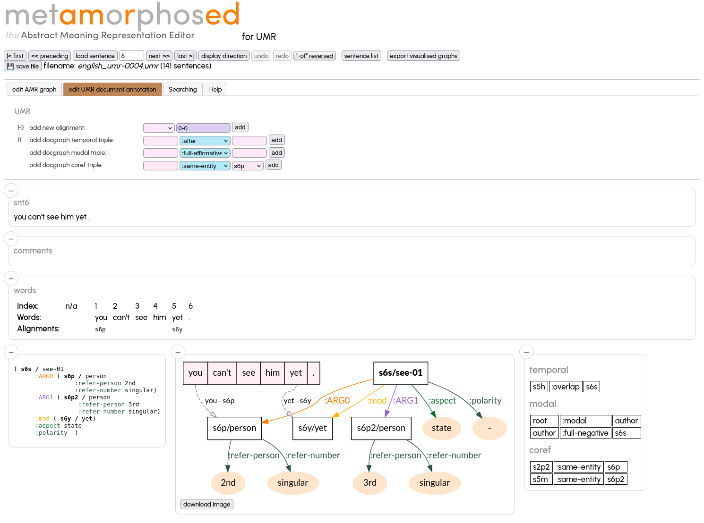
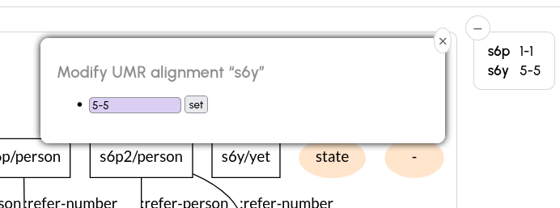
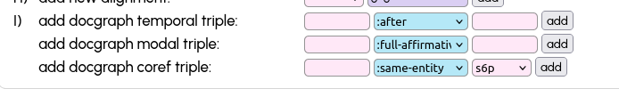
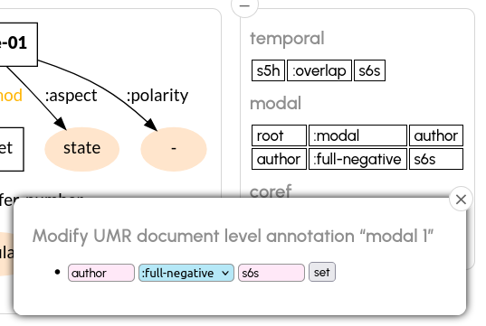

# Uniform Meaning Representation (UMR)

Is a multilingual extension to AMR which also annotates semantic links between sentences of a document, temporal sequences and alignments beween tokens and instances. For more information see the UMR project website at https://umr4nlp.github.io/web/.

_metAMoRphosed_ can handle standard UMR files as provided by the UMR project and described in the [UMR Schema reference](https://umr4nlp.github.io/web/UMRSchemaPages/index.html).

The minimal content of a UMR file which _metAMoRphosed_ is the following:

```
################################################################################
# meta-info :: sent_id = u_tree-cs-s1-root
# :: snt1
Index: 1   2    3 4     5      6       7  8           9         10
Words: 200 dead , 1,500 feared missing in Philippines landslide . 

# sentence level graph:
()

# alignment:

# document level annotation:

```

The only data needed is the structure (lines starting with `#`) and the lines `Words:` and `Index:` which contain the tokens of the sentence and the position of the token in the sentence (starting with 1).

The sentence level graph is usually a PENMAN graph like AMR, but with UMR specific relations and variable names which always start with `sN` with `N` being the sentence number which also show in the line `# :: sntN`.

To use _metAMoRphosed_ in UMR mode, the server has to be started with the additional option `--umr`. Since UMR relations differ from AMR relations, the options 
`--relations` and `--relationsdoc` have to be used (the needed files are in `metamorphosed/data`).
For instance:

```
uv run ./metamorphosed_server.py \
    -f </data/>en-0001.umr \
    --umr \
    --relations metamorphosed/data/umr-relations.txt  
    --relationsdoc metamorphosed/data/umr-relations-doc.json
    --port 4567
```

the options `--relations metamorphosed/data/umr-relations.txt`  `--relationsdoc metamorphosed/data/umr-relations-doc.json` are default options, so strictly speaking they are not necessary.

Open your browser on `http://localhost:4567:



## Edit the sentence level graph

This works as with AMR files (see [README.md](README.md))

## Edit the alignments

Alignments are correspondances between instances of the sentence level graph and words of the sentence.
There are three ways to add/modify/delete alignments:

### add alignment
* add a new alignment (i.e. for a variable which is not yet aligned with a word, in our example `s6p2` and `s6s`): click on the word in the `Words:` line and than on the instance in the graph. If the variable you click on, has already an alignment, it is overwritten with the new one
* add a new alignment. Choose the variable in the UMR section on the top left (`H) add new alignment`)

### modify alignement

Click on the alignment in the `Alignments:` line and edit it accordingly and click `set`. If the format is incorrect (startposition - endposition), the input is not accepted and an error message is given.



An empty input field removes all alignments for the given instance. Separate multiple alignments with a comma: `4-4, 6-6`)

## Edit the document level annotation

Adding new temporal, modal or coref triples use the input fields on the top left (`I) add docgraph ....`



In order to edit (or remove) existing triples, click on a triple and edit it the pop-up. An empty field deletes the triple.
Validate by clicking on `set`, cancel by clicking on the circled `X` (top right)



## Limitations

* `Words:` and `Index:` (and `Morphemes:` etc.) lines cannot yet be modified
* Document level annotations constraints are not yet all enforced

* TODO:
  * check whether variables in document level annotations are in document (Subject) or in current sentence (Object)
  * make `Words:`, `Index:` etc. editable
  * activate undo/redo for changes in Alignments nad Document Level Annotation
  * export UMR graphs correctly


