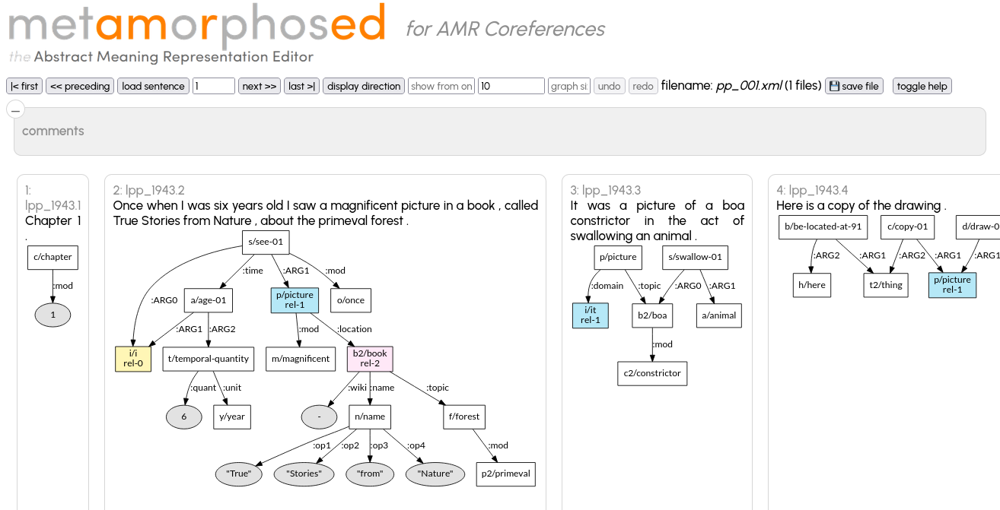
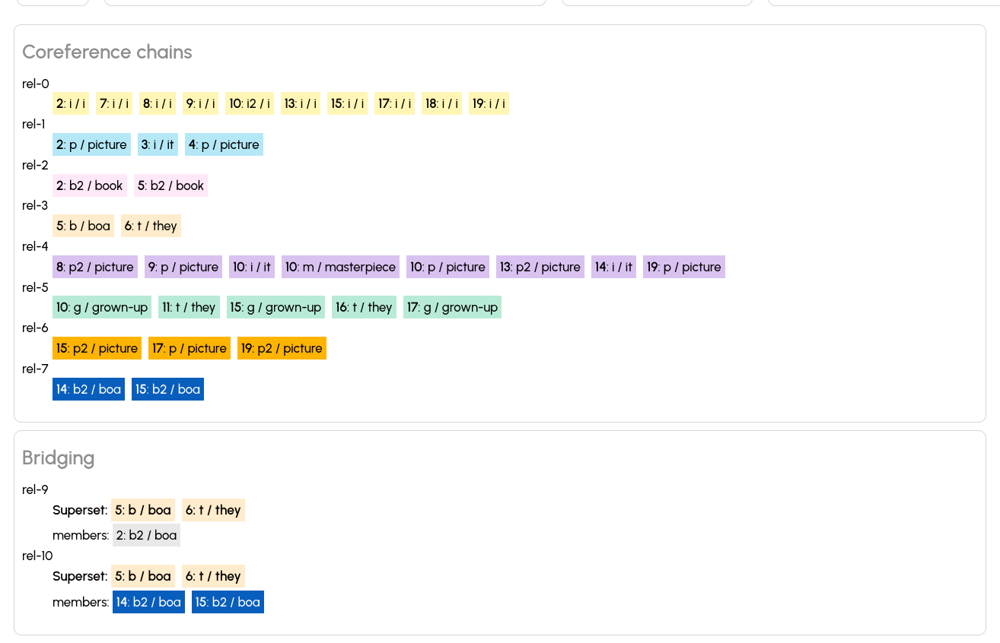

# Coreference annotation

Version 1.4 (see [CHANGES.md](CHANGES.md))

The `corefserver.py` is a tool to annotate coreferences across AMR graphs corresponding to a list of consecuting sentences.
It uses the same annotation format as the multi-sentences of  AMR 3.0 (see below).

However, some information present in the AMR coreference data is not yet editable

* implicit roles are displayed in the interface if present in the XML file but can neither be modified nor be added if missing
* singletons and bridging is neither displayable nor modifiable, but existing information is not lost when editing a file containing this information

## Preparing an annotation

The first step is preparing an empty annotation file with all sentence ids of sentences present in an AMR annotatet file

initialise xml files with `corefinit.py` 

```
corefinit.py --sids ENG_DF_000170_20120302_C000205QT_0001 ENG_DF_000202_20100605_C0001T7OW_0001  -a amr-release....txt
corefinit.py --sids PROXY_APW_ENG_20080417_1113 -o msamr_proxy_%03d.xml --startid 124 -a  amr-release....txt
```

which creates `prefix.xml` (but with `relations` empty)

```
<?xml version="1.0" encoding="UTF-8"?>
<!DOCTYPE msamr SYSTEM "msamr.dtd">

<document>
   <sentences annotator="" docid="bolt-eng-DF-199-192783-6849434" end="" site="" sourcetype="" start="" threadid="">
      <amr id="DF-199-192783-684_9434.1" order="0" post="p1" speaker="unk" su="1"/>
      <amr id="DF-199-192783-684_9434.2" order="1" post="p1" speaker="unk" su="2"/>
      <amr id="DF-199-192783-684_9434.3" order="2" post="p1" speaker="unk" su="3"/>
      <amr id="DF-199-192783-684_9434.4" order="3" post="p2" speaker="unk" su="1"/>
      <amr id="DF-199-192783-684_9434.5" order="4" post="p2" speaker="unk" su="2"/>
   </sentences>
   <relations>
      <identity>
         <identchain relationid="rel-0">
            <mention concept="it" id="DF-199-192783-684_9434.2" variable="i"/>
            <implicitrole argument="ARG2" id="DF-199-192783-684_9434.4" parentconcept="risk-01" parentvariable="r2"/>
         </identchain>
         <identchain relationid="rel-1">
            <mention concept="person" id="DF-199-192783-684_9434.2" variable="p3">George_W._Bush</mention>
            <mention concept="he" id="DF-199-192783-684_9434.4" variable="h"/>
            <mention concept="person" id="DF-199-192783-684_9434.5" variable="p"/>
            <implicitrole argument="ARG0" id="DF-199-192783-684_9434.4" parentconcept="risk-01" parentvariable="r2"/>
         </identchain>
         <identchain relationid="rel-2">
            <mention concept="you" id="DF-199-192783-684_9434.2" variable="y"/>
            <mention concept="you" id="DF-199-192783-684_9434.1" variable="y"/>
         </identchain>
      </identity>
      <singletons/>
      <bridging/>
   </relations>
</document>
```

Needs AMR data like
```
# ::id DF-199-192783-684_9434.1 ::date 2013-08-15T13:57:36 ::annotator SDL-AMR-09 ::preferred
# ::snt What do you think the consequences would be?
# ::save-date Thu Nov 2, 2017 ::file DF-199-192783-684_9434_1.txt
(t / think-01
      :ARG0 (y / you)
      :ARG1 (a / amr-unknown
            :ARG2-of (c / consequence-03)))

# ::id DF-199-192783-684_9434.2 ::date 2013-08-15T14:02:37 ::annotator SDL-AMR-09 ::preferred
# ::snt Do you think the Shrub could pull it off?
# ::save-date Fri Dec 6, 2013 ::file DF-199-192783-684_9434_2.txt
(t / think-01
      :ARG0 (y / you)
      :ARG1 (p / pull-off-03
            :ARG0 (p3 / person :wiki "George_W._Bush"
                  :name (n / name :op1 "Shrub"))
            :ARG1 (i / it)
            :ARG1-of (p2 / possible-01))
      :polarity (a / amr-unknown))

# ::id DF-199-192783-684_9434.3 ::date 2013-08-15T14:06:28 ::annotator SDL-AMR-09 ::preferred
# ::snt If not, why?
# ::save-date Mon Nov 2, 2015 ::file DF-199-192783-684_9434_3.txt
(a / amr-unknown
      :ARG0-of (c / cause-01)
      :condition (h / have-polarity-91
            :ARG2 -))

# ::id DF-199-192783-684_9434.4 ::date 2013-08-15T14:10:15 ::annotator SDL-AMR-09 ::preferred
# ::snt His approval rating cannot sink, so, what's the risk.
# ::save-date Tue May 19, 2015 ::file DF-199-192783-684_9434_4.txt
(s / sink-01
      :ARG1 (r / rate-01
            :ARG3 (a / approve-01
                  :ARG1 (h / he)))
      :ARG1-of (p / possible-01 :polarity -)
      :ARG0-of (c / cause-01
            :ARG1 (a2 / amr-unknown
                  :ARG1-of (r2 / risk-01))))

# ::id DF-199-192783-684_9434.5 ::date 2013-08-15T14:15:18 ::annotator SDL-AMR-09 ::preferred
# ::snt After all, he's the Decider, and Congress holds his trousers while he skinny dips.
# ::save-date Mon Aug 26, 2013 ::file DF-199-192783-684_9434_5.txt
(a / and
      :op1 (p / person
            :ARG0-of (d / decide-01
                  :mod (a2 / after-all))
            :domain (h / he))
      :op2 (h2 / hold-01
            :ARG0 (g / government-organization :wiki "United_States_Congress"
                  :name (n / name :op1 "Congress"))
            :ARG1 (t / trousers
                  :poss p)
            :time (d2 / dip-02
                  :ARG0 p
                  :manner (s / skin))))
```

## Run `corefserver.py`

To start the server, run 

```
<install-path>/amr-editor/coref/corefserver.py \
	--xml <listof xml files> \
	--amrfiles <list of amr files containing the sentences referenced in the xml files> \
        [--port 4567]
```


## Editing

Once the editor is started, point your navigator to `http://localhost:4567`



Each graph is displayed with coreferential instances marked (in same calour and the coreference chain id (`rel-1`)).

In order to add an instance to an existing coreference chain, just click on an instance of the chain and then on the instance which you want to add to the chain. To take an instance out of (any) chain, click twice on it. If a chain contains only a single instances, it is deleted automatically

To create new coreference chain, click on two instances one after the other.


If you scroll the screen further down, you'll find a complete list of all
coreference chains, followed by bridging groups (the latter cannot yet be modified)



